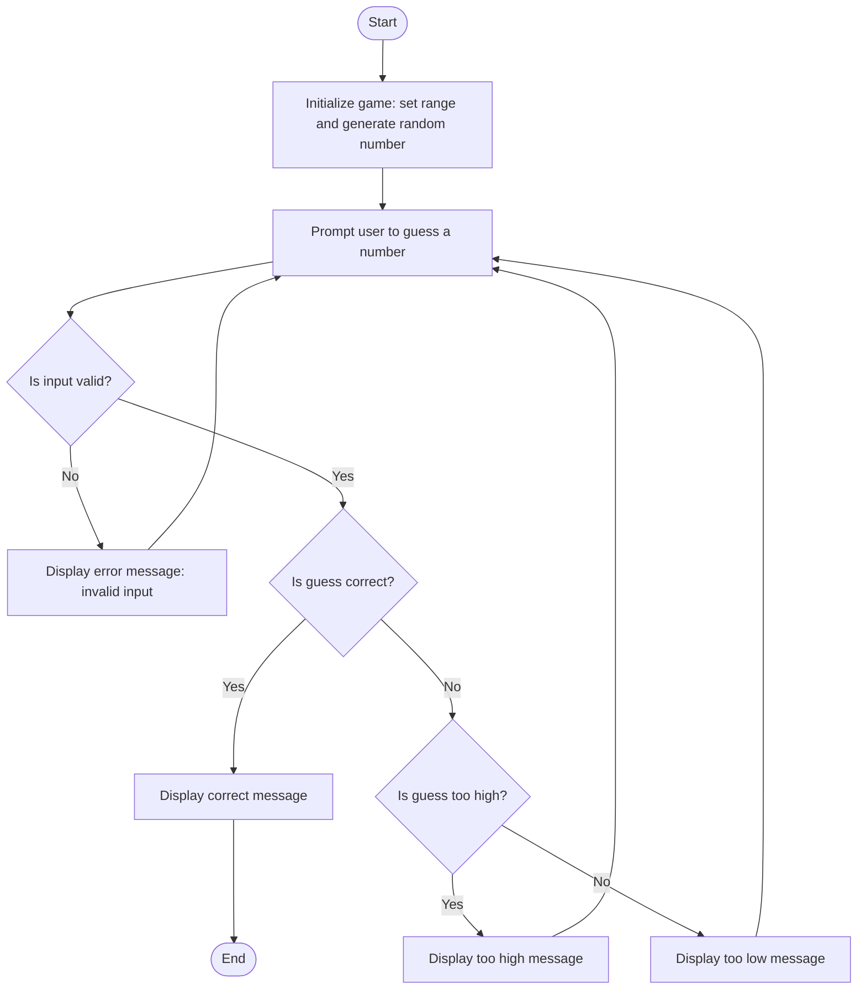

# Random Guessing Game Flowchart

## Description of Each Step

**Start**: The program begins execution.

**Initialize Game**: A random number is generated within a specified range. This is the target number the user must guess.

**Prompt User**: The user is asked to input a guess.

**Input Validation**:  
- If the input is not a valid number, an error message is displayed and the user is prompted again.  
- If the input is valid, the program continues.

**Compare Guess**:  
- If the guess matches the random number, the program congratulates the user and ends.  
- If the guess is incorrect, it checks whether the guess is too high or too low.

**Too High / Too Low**:  
- If the guess is too high, a message is shown and the user is prompted again.  
- If the guess is too low, a similar message is shown and the user is prompted again.

**End**: The game ends when the user guesses correctly.
